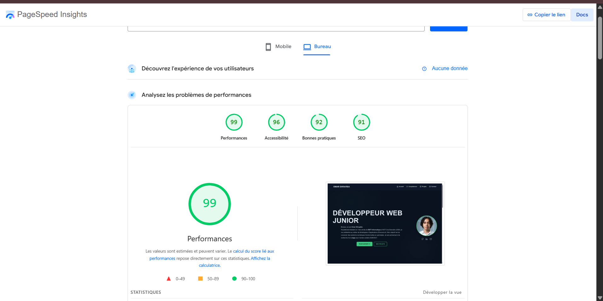

# Portfolio - BUT Informatique

Ce dépôt contient le code source de mon portfolio, réalisé pour valider ma fin de première année de BUT Informatique (parcours Réalisation d'applications) à l'IUT 2 de Grenoble. 

L'objectif principal de ce site est de documenter les projets que j'ai réalisés cette année, et de me servir de support visuel pour ma recherche d'alternance pour la rentrée de septembre 2026.

## Technologies utilisées

Le site est développé de manière classique, sans framework :
- HTML5 et CSS3 (utilisation de Flexbox, CSS Grid et de variables pour gérer les couleurs).
- JavaScript (Vanilla) pour gérer les interactions de la page.
#Performances et Qualité Web

Une attention particulière a été portée à l'optimisation globale du portfolio (réduction du poids des ressources, sémantique HTML stricte, accessibilité). L'objectif est d'appliquer concrètement les bonnes pratiques du web dès cette première année. 

Les résultats de l'audit Google PageSpeed Insights (Lighthouse) sur la version bureau confirment cette démarche qualité :

## Organisation du code

Pour éviter de dupliquer du code HTML inutilement, j'ai fait le choix de stocker les informations de mes projets (comme le site Allo Kiné ou le jeu du Morpion) dans un tableau JavaScript. 

Le script se charge d'injecter ces données dynamiquement dans la page d'accueil. Lorsqu'on clique sur un projet, les détails (la structure PPP : objectifs, compétences, rôle) s'affichent dans une fenêtre modale.

## Comment lancer le projet

Le projet est entièrement statique. Il n'y a aucune installation requise.
Pour visualiser le site en local, il suffit de récupérer les fichiers et d'ouvrir `index.html` dans n'importe quel navigateur web.
